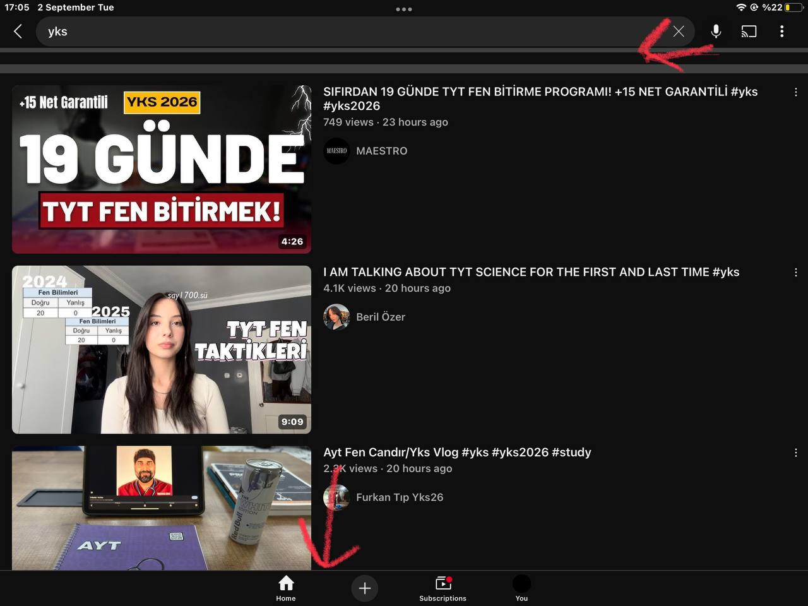

# SAtube

**SAtube** is an iOS tweak that completely removes YouTube Shorts from the feed and bottom tab bar. It helps users stay focused and reduce distractions while using YouTube, making it especially beneficial for students, professionals, or anyone aiming to improve their concentration and study/work sessions.

!

---
## Why This Tweak Exists

YouTube has never provided an official way to disable Shorts, despite numerous user requests. Shorts are designed to grab attention and encourage endless scrolling, which can be highly distracting.

**Benefits of SAtube:**

- Removes all Shorts videos from your main YouTube feed.
- Removes the Shorts tab/icon from the bottom navigation bar.
- Helps increase focus during study, work, or personal projects.
- Reduces the likelihood of falling into “binge-scrolling” sessions.
- Supports users in managing screen time and improving productivity.

This tweak is particularly helpful for students preparing for exams or anyone who wants to maximize focus without YouTube interruptions.

---

## Features

- **Feed Cleanup:** No Shorts videos appear on your main feed.
- **Tab Removal:** Shorts icon/tab is removed from the bottom navigation bar.
- **Focus-Friendly:** Helps you stay on track during study or work sessions.
- **Lightweight:** Minimal impact on app performance.

---

## Installation via Sideloadly (IPA Method)

If you are on iOS without a jailbreak, you can install SAtube using **Sideloadly**.

---

## Notes

- Works with the latest versions of YouTube (tested up to version 20.34.2).  
- Requires sideloading tools or a jailbroken device with Theos.  
- Designed for personal use; be mindful of YouTube’s Terms of Service.

---

## Disclaimer

SAtube is provided as-is. Use at your own risk. The developer is not responsible for any issues caused by installation or usage. This tweak modifies the YouTube app behavior to enhance focus and reduce distractions.

---

## Contributing

Pull requests and suggestions are welcome! Please ensure compatibility with the latest YouTube updates.

